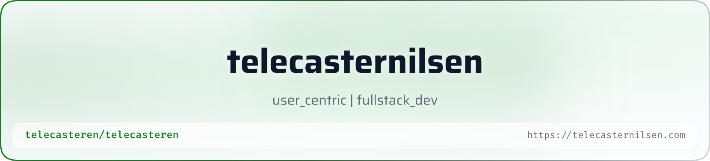

<picture>
   <source media="(prefers-color-scheme: dark)" srcset="art/header-dark.png">
   
</picture>

<h1 align="center">Hi there, I'm Tele 👋</h1>

<p align="center">
<a href="https://git.io/typing-svg"></a>
</p>


---


<details>
<summary>npm start (click)</summary>


```bash
        
      \  \    /   /
    ___________________
    |                 |
    |░░░░░░░░░░░░░░░░░|---|
     \███████████████/___/
      \█████████████/


```


### Reach me:

- [telecasternilsen](https://telecasternilsen.com/#contact)
- [linkedIn](https://www.linkedin.com/in/tele-caster-nilsen-7002b9249/)


👨‍🎓 A student at [Noroff University](#studies).<br/>
🌱 Focused on learning and evolving both as dev and human.

---

### School:<br/>

**Front-End development**<br/>
Noroff School of Technology and Digital Media - [Noroff University](https://www.noroff.no/en/studies/vocational-school/front-end-development)

**Other studies**<br/>
- [Rustlings](https://github.com/rust-lang/rustlings) and [Book of Rust](https://doc.rust-lang.org/stable/book/)<br/>
- Java
- C#

### Core foundation
✅ HTML, CSS, JavaScript, Typescript, MySQL / SQL<br/>
✅ React, Redux, Zod, Tailwind<br/>
🟠 [Rust](https://doc.rust-lang.org/stable/book/) _(Beginner)_ <br/>
🟠 [C#](https://learn.microsoft.com/en-us/dotnet/csharp/) _(Beginner)_ <br/>
🟠 [.NET](https://dotnet.microsoft.com/en-us/) _(Beginner)_

---

**Preferred IDEs**
- [VS Code](https://code.visualstudio.com/), [Zed](https://zed.dev)

**Tools & other frameworks**
- Git, Postman, Node.js, Express.js, Next.js, MUI, Bootstrap

**Database and deployment**
- Docker, Vercel, Netlify, Render, Firebase, Prisma(ORM), Neon, Upstash/Redis

---

**Oh, and here's a cool button**
🐍 <a href="https://codepen.io/telecasteren/pen/MYKrpoK" target="_blank">Snake button</a>
</details>
